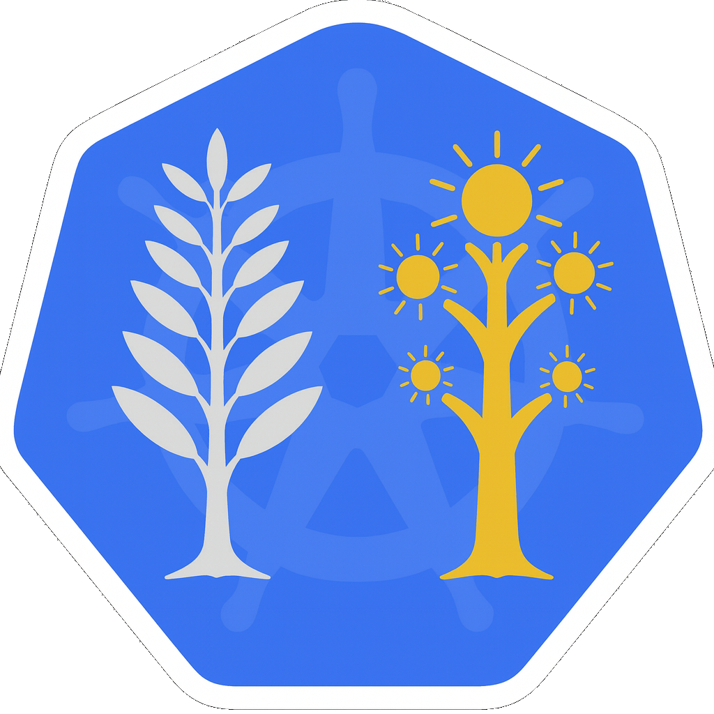

<div align="center">



# ktwins

KTwins is a terminal dashboard for Kubernetes clusters. Built with Go and tview, it is designed to be fast, keyboard-driven, and easy to ship as a single, self-contained binary.

Its visual identity is inspired by the Two Trees of Valinor, reflecting duality, balance, and clarity in cluster observability.

</div>

---

## Table of Contents
- [Features](#features)
- [Screenshots](#screenshots)
- [Install](#install)
- [Run from source](#run-from-source)
- [Usage](#usage)
- [Shortcuts](#shortcuts)
- [Architecture](#architecture)
- [Releases](#releases)

## Features
- Workloads, network, cluster, and metrics views in one screen.
- Keyboard-only navigation with quick logs/describe modals.
- Auto-refresh every 2s with compact layout (empty boxes shrink).
- Namespace switching via hotkeys.
- Safe shelling out to `kubectl` plus `client-go` for counts.

## Screenshots
- Default (workloads + pods navigation)
  
- Logs modal
  
- Events popup
  
- Network page
  
- Service describe
  
- ConfigMap describe
  
- Pod metrics
  

## Install
### Install script (latest release)
Downloads the latest release for your OS/arch and installs to `/usr/local/bin` (or current dir if not writable). Override with `BIN_DIR` (e.g., `BIN_DIR=~/.local/bin`).
```bash
curl https://raw.githubusercontent.com/uiratan/ktwins/main/deployment/getLatest.sh | bash
```

### Manual download
- Grab the binary from the [Releases](https://github.com/uiratan/ktwins/releases) page (`ktwins_<version>_<os>_<arch>.tar.gz`).
- Extract and place `ktwins` somewhere on your `PATH`.

## Run from source
Requires Go (matching `go.mod`).
```bash
# run
GOCACHE=$(pwd)/.cache go run ./cmd/ktwins [namespace]

# build
make build               # outputs bin/ktwins
# or
GOCACHE=$(pwd)/.cache go build -o bin/ktwins ./cmd/ktwins

# optional install to GOPATH/bin or GOBIN
go install ./cmd/ktwins

# clean artifacts and cache
make clean
```

## Usage
- Run `ktwins [namespace]` (empty or `all` shows all namespaces).
- Use shortcuts below to navigate pages/boxes, open logs/describe, and switch namespaces.

## Shortcuts
- Pages: `w` workloads · `n` network · `c` cluster · `m` metrics · arrows ←/→ cycle pages.
- Focus between boxes: arrows ↑/↓.
- Browse items: `Enter` to browse, arrows ↑/↓ move selection, `Esc` exits.
- Actions: `l` pod logs · `d` describe selected resource.
- Popups: `a` alerts · `e` events · `Esc` closes modal.
- Namespace: `0-9` selects the index shown in NAMESPACES.
- Quit: `q`.

## Architecture
- `cmd/ktwins/` — entrypoint.
- `internal/ui/` — dashboard state, navigation, modals, input handling.
- `internal/data/` — `kubectl`/`client-go` wrappers for lists, metrics, events, summaries.
- `internal/theme/` — color palette/tags.

Data fetching:
- `client-go` for overview counts.
- `kubectl` for listings, logs (`logs --tail=200`), describe, metrics (`top pods`), events (`get events --sort-by`), namespaces (`get ns`).

## Releases
- CI: `.github/workflows/ci.yml` runs tests and builds on pushes/PRs.
- Release: `.github/workflows/release.yml` runs GoReleaser on tags `v*.*.*`, producing multi-platform artifacts and checksums. Release notes are taken from `CHANGELOG.md` (e.g., section `## v1.0.0 - ...`).
